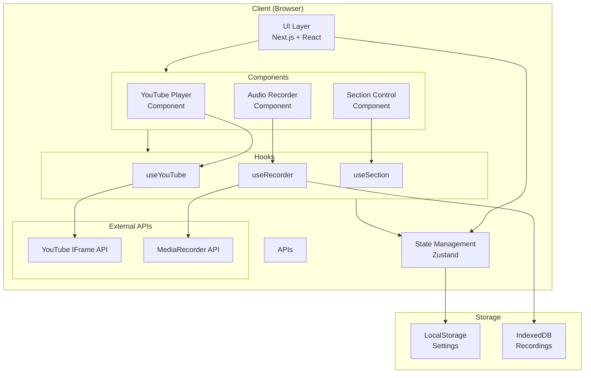
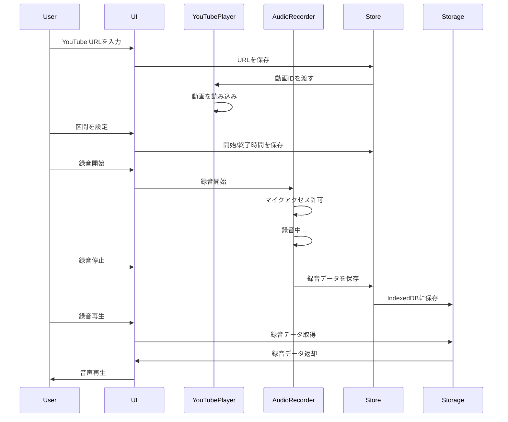
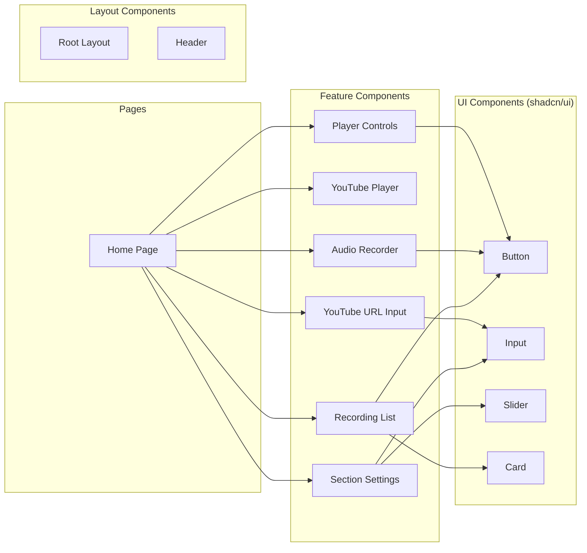
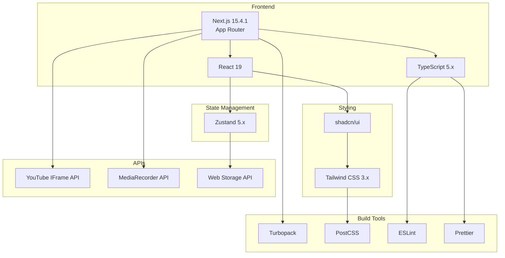
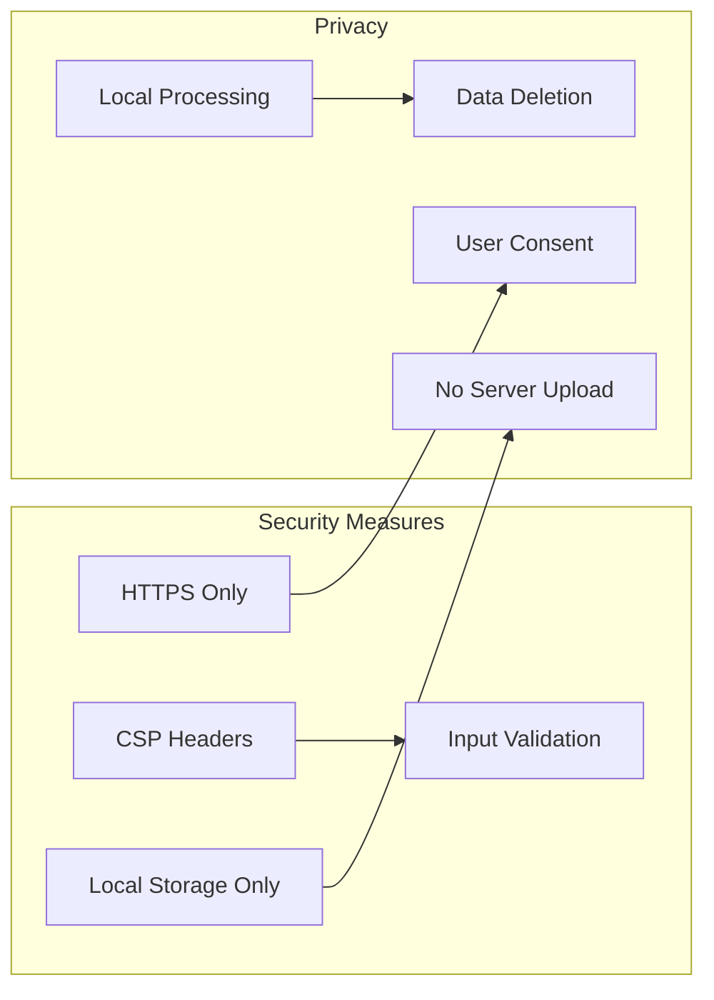

# アーキテクチャ図：英語シャドーイング練習ツール

## システム全体図



## データフロー図



## コンポーネント関連図



## 状態管理フロー

```mermaid
stateDiagram-v2
    [*] --> Idle
    
    Idle --> VideoLoaded: URL入力
    VideoLoaded --> Playing: 再生開始
    VideoLoaded --> SectionSet: 区間設定
    
    Playing --> Paused: 一時停止
    Paused --> Playing: 再開
    Playing --> Looping: ループ有効
    
    SectionSet --> Playing: 再生開始
    
    state Recording {
        [*] --> Ready
        Ready --> Recording: 録音開始
        Recording --> Stopped: 録音停止
        Stopped --> Saved: 保存
        Saved --> Ready
    }
    
    Playing --> Recording: 録音開始
    Looping --> Recording: 録音開始
```

## 技術スタック層



## フォルダ構造詳細

```
shadowing-helper/
├── src/
│   ├── app/                      # Next.js App Router
│   │   ├── layout.tsx           # ルートレイアウト
│   │   ├── page.tsx             # ホームページ
│   │   ├── globals.css          # グローバルスタイル
│   │   └── favicon.ico          
│   │
│   ├── components/              # コンポーネント
│   │   ├── ui/                  # shadcn/ui 基本コンポーネント
│   │   │   ├── button.tsx
│   │   │   ├── input.tsx
│   │   │   ├── slider.tsx
│   │   │   └── card.tsx
│   │   │
│   │   ├── youtube-player/      # YouTube再生機能
│   │   │   ├── index.tsx
│   │   │   ├── player.tsx
│   │   │   └── url-input.tsx
│   │   │
│   │   ├── audio-recorder/      # 録音機能
│   │   │   ├── index.tsx
│   │   │   ├── recorder.tsx
│   │   │   ├── recording-list.tsx
│   │   │   └── audio-player.tsx
│   │   │
│   │   └── section-control/     # 区間設定機能
│   │       ├── index.tsx
│   │       ├── time-input.tsx
│   │       └── loop-control.tsx
│   │
│   ├── hooks/                   # カスタムフック
│   │   ├── use-youtube.ts       # YouTube API管理
│   │   ├── use-recorder.ts      # 録音機能管理
│   │   ├── use-section.ts       # 区間設定管理
│   │   └── use-storage.ts       # ストレージ管理
│   │
│   ├── lib/                     # ユーティリティ
│   │   ├── utils.ts             # 共通関数
│   │   ├── youtube.ts           # YouTube関連
│   │   ├── audio.ts             # 音声処理関連
│   │   └── storage.ts           # ストレージ関連
│   │
│   ├── stores/                  # Zustand ストア
│   │   ├── player-store.ts      # 再生状態
│   │   ├── recorder-store.ts    # 録音状態
│   │   └── section-store.ts     # 区間設定状態
│   │
│   └── types/                   # 型定義
│       ├── index.ts             # 共通型
│       ├── youtube.d.ts         # YouTube API型
│       └── recorder.d.ts        # 録音関連型
│
├── public/                      # 静的ファイル
│   └── icons/                   # アイコン
│
├── docs/                        # ドキュメント
│   ├── requirements.md          # 要件定義書
│   ├── technology-stack.md      # 技術選定書
│   └── architecture-diagram.md  # アーキテクチャ図
│
├── .env.local                   # 環境変数
├── .gitignore
├── next.config.js               # Next.js設定
├── tailwind.config.ts           # Tailwind設定
├── tsconfig.json                # TypeScript設定
├── package.json
└── README.md
```

## セキュリティとプライバシー



この設計により、シンプルかつ拡張可能なアーキテクチャを実現し、ユーザーのプライバシーを保護しながら高品質なシャドーイング練習体験を提供します。